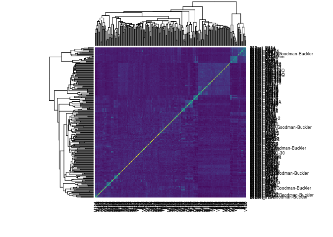
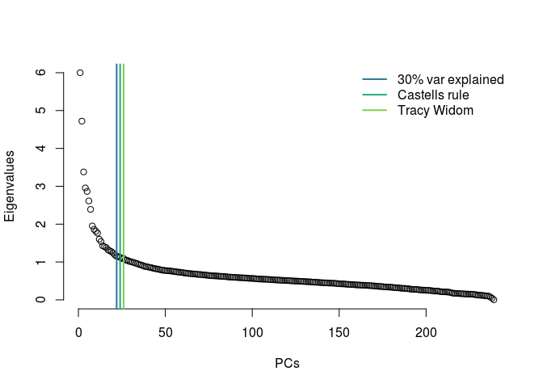
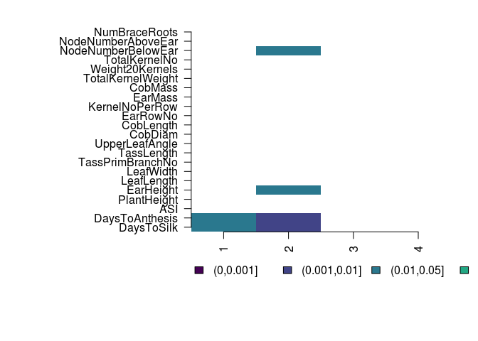
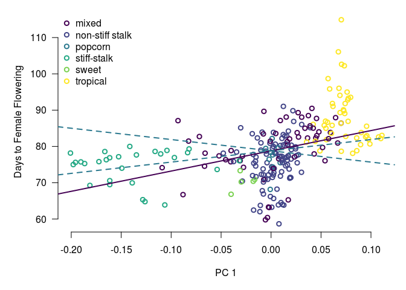
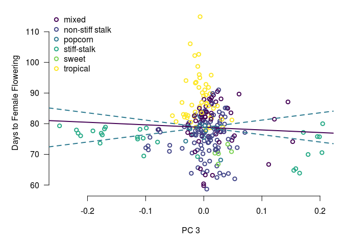

This notebook has code for running a form of Q<sub>pc</sub> analysis in a GWAS panel of 240 maize lines. 

### 1. read in the kinship matrix and trait data


```r
#read in the kinship matrix
myK = read.table('data/All_240E.nomaf.nomissing.K')
myKnames = read.table('data/240.names', stringsAsFactors = F)$V1
row.names(myK) = myKnames[1:dim(myK)[1]]
heatmap(as.matrix(myK), col=viridis(256))
```

<!-- -->

```r
#do the eigen decomposition
eigF = eigen(myK)
myU = eigF$vectors
myLambdas = eigF$values

#read in trait values
bluptable= read.table('data/blups_240', header=T)
mytraitsnice = sapply(names(bluptable)[-1], function(x){
  strsplit(x, '0607')[[1]][1]
}) ##neaten up the trait names
names(bluptable) = c('line',mytraitsnice)
```

### 2. calculate the PC cutoffs we're using for tests of selection


```r
varexp = myLambdas/sum(myLambdas)
sumexp = sapply(1:length(varexp), function(x){sum(varexp[1:x])})

#get cutoffs for how many pcs to look at
pcmax = which(sumexp > 0.3)[1]


plot(myLambdas, bty="n", xlab = "PCs", ylab = "Eigenvalues")
abline(v = pcmax, col = viridis(6)[3], lwd=2)
```

<!-- -->

```r
#remove the last end of PCs since these are likely to be extra variable
#tailCutoff = round(.9*length(myLambdas))
tailCutoff=0
```

### 3. We can test for excess variation along specific PCs.

```bash
cat qpctools/R/calcQpc.R
```

```
## #' Calculate Qpc
## #'
## #' This function calculates Qpc given data about the relatedness matrix, and a set of trait values
## #' @param myZ vector of traits. Not normalized yet.
## #' @param myU matrix of eigenvectors of the kinship matrix (each column is an eigenvector)
## #' @param myLambdas vector of eigenvalues of the kinship matrix 
## #' @param myPCcutoff a value that determines how many PCs you want to look at. For example, 0.5 would mean that you would look at the first set of PCs that explain 0.5 of the variation. The default here is 0.3
## #' @param tailCutoff is there if you don't want to use the last PCs to estimate Va because of excess noise. The default value is 0.9, which means that you're not using the last 10% of your PCs. Set to 1 if you want to use all PCs
## #' @param vapcs is the number of pcs used to estimate Va. Default is 50.
## #' @export
## #' @examples
## #' calcQpc()
## 
## calcQpc <- function(myZ, myU, myLambdas, myPCcutoff = 0.3, tailCutoff = 0.9, vapcs = 50){
##   myTailCutoff = round(tailCutoff*length(myLambdas)) #picks the end of the set of pcs used to calculate va
##   pcm = which(sapply(1:length(myLambdas), function(x){sum(myLambdas[1:x])/sum(myLambdas)}) > myPCcutoff)[1] #the number of pcs tested
##   
##   myZ = myZ[1:dim(myU)[1]] - mean(myZ) #mean center phenotypes
##   myCm = (myZ %*% myU)/sqrt(myLambdas) #project + standardize by the eigenvalues
##   myQm = sapply(1:pcm, function(n){
##     var0(myCm[n])/var0(myCm[(myTailCutoff-vapcs):myTailCutoff])
##   })  #test for selection
##   myPs = sapply(1:pcm, function(x){pf(myQm[x], 1, vapcs, lower.tail=F)}) #get a pvalue
##   retdf = list(cm = myCm, qm = myQm, pvals = myPs)
##   return(retdf)
##   }
## 
## 
## 
## 
```


```r
mydfs = apply(bluptable[,-1], 2, function(x){calcQpc(
  myZ = x, myU = eigF$vectors, myLambdas = eigF$values, myPCcutoff=0.3, vapcs = 119, tailCutoff = 1
)})
```


### 4. Make plots and look at the data


```r
getqvalues <- function(ptable){
qobj = qvalue(p = c(ptable))
myqvals = matrix(qobj$qvalues, nrow=dim(ptable)[1])
return(myqvals)
}

allpvals = sapply(1:22, function(x){mydfs[[x]]$pvals})
myqvals = getqvalues(allpvals)

#mysig = apply(allqvals, 2, function(x){ cut(x, c(0,0.001,0.01,0.05,0.1,1), labels=F)})
layout(matrix(1, nrow=1, ncol=1))
mysig2 =  cut((1:1000/1000), c(0,0.001,0.01,0.05,0.1,1)) #for legend
par(mar=c(8,14,2,2), xpd=TRUE, mfrow=c(1,1))
mycol = c(viridis(6, direction=1)[1:4], "white")
image(myqvals, col=mycol, xaxt="n", yaxt="n", bty="n", breaks=c(0,0.001,0.01,0.05,0.1,1))
axis(1, at=seq(0,1, length=pcmax), las=2, label=1:pcmax)
axis(2, at=(0:21)/21, labels = mytraitsnice, las=2)
legend(-0.2,-0.15, levels(mysig2), fill=mycol, bty="n", horiz=T)
```

<!-- -->

### 7. More plots looking at correlations between PCs and traits.


```r
#function to calculate confidence intervals. This is mainly useful for plotting and these do not go into the actual statistical test.

calcCIs <- function(myName, myBlups=bluptable, myU=eigF$vectors, myLambdas=eigF$values){
  myZ = myBlups[,myName][1:239]
  myZ = myZ - mean(myZ)
  myBm = myZ %*% myU
  myCm = myBm/sqrt(myLambdas)
  myVa = var0(myCm[(119):238])
  myCI = sqrt(myVa*myLambdas)
  return(myCI)}

par(mar=c(5,5,1,1), mfrow=c(1,1))

#read in population data and merge with traits and eigenvectors
fgtable = read.table('data/FlintGarciaTableS1.csv', sep=',', header=T, stringsAsFactors = F)
mydf = data.frame(bluptable[-nrow(bluptable),], eigF$vectors, stringsAsFactors = F)
mydf$fgname = sapply(as.character(mydf$line), function(x){strsplit(x,'_')[[1]][2]})
fgmerge = dplyr::inner_join(mydf, fgtable, by=c('fgname'='Inbred'))

palette(viridis(6))
nicepops = c('mixed','non-stiff stalk','popcorn','stiff-stalk','sweet','tropical')
indvar = sqrt(diag(as.matrix(myK)))

myCIsDTS = calcCIs('DaysToSilk')
myCIsTKN = calcCIs('TotalKernelNo')


save(mydfs, allpvals,myqvals, mytraitsnice, fgmerge, myCIsDTS, myCIsTKN,file="data/qpc-maize_results.rda")

par(xpd=FALSE)
plot(fgmerge$X1, fgmerge$DaysToSilk, bty="n", xlab = "PC 1", ylab = "Days to Female Flowering", yaxt="n", col=as.factor(fgmerge$Subpopulation), lwd=2)
axis(2, las=2)
legend('topleft', nicepops, bty="n", pch=1, pt.lwd=2, col = viridis(6))
abline(lm(fgmerge$DaysToSilk ~ fgmerge$X1), col=viridis(6)[1], lwd=2)
abline(a=mean(fgmerge$DaysToSilk), b = 1.96*myCIsDTS[1], lty=2, col=viridis(6)[3], lwd=2)
abline(a=mean(fgmerge$DaysToSilk), b = -1.96*myCIsDTS[1], lty=2, col=viridis(6)[3], lwd=2)
```

<!-- -->

```r
plot(fgmerge$X10, fgmerge$DaysToSilk, bty="n", xlab = "PC 10", ylab = "Days to Female Flowering", yaxt="n", col=as.factor(fgmerge$Subpopulation), lwd=2)
axis(2, las=2)
legend('topright', nicepops, bty="n", pch=1, pt.lwd=2, col = viridis(6))
abline(lm(fgmerge$DaysToSilk ~ fgmerge$X10), col=viridis(6)[1], lwd=2)
abline(a=mean(fgmerge$DaysToSilk), b = 1.96*myCIsDTS[10], lty=2, col=viridis(6)[3], lwd=2)
abline(a=mean(fgmerge$DaysToSilk), b = -1.96*myCIsDTS[10], lty=2, col=viridis(6)[3], lwd=2)
```

<!-- -->

```r
plot(fgmerge$X3, fgmerge$DaysToSilk, bty="n", xlab = "PC 3", ylab = "Days to Female Flowering", yaxt="n", col=as.factor(fgmerge$Subpopulation), lwd=2)
axis(2, las=2)
legend('topleft', nicepops, bty="n", pch=1, pt.lwd=2, col = viridis(6))
abline(lm(fgmerge$DaysToSilk ~ fgmerge$X3), col=viridis(6)[1], lwd=2)
abline(a=mean(fgmerge$DaysToSilk), b = 1.96*myCIsDTS[3], lty=2, col=viridis(6)[3], lwd=2)
abline(a=mean(fgmerge$DaysToSilk), b = -1.96*myCIsDTS[3], lty=2, col=viridis(6)[3], lwd=2)
```

<!-- -->
