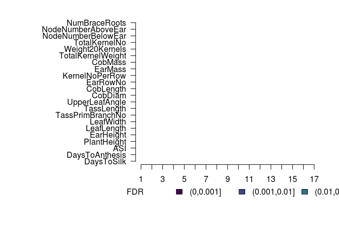
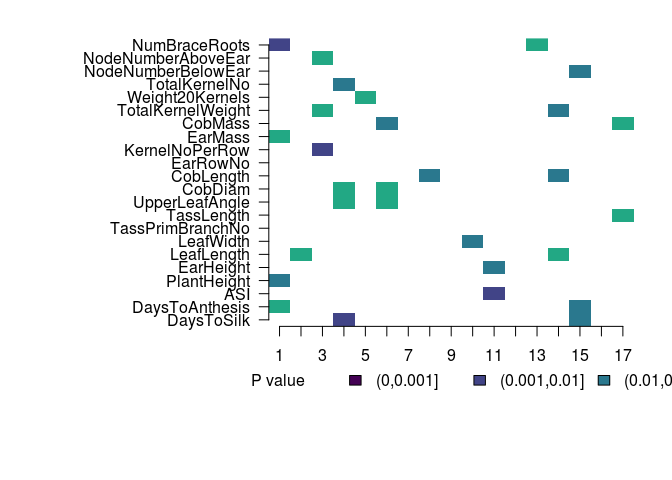
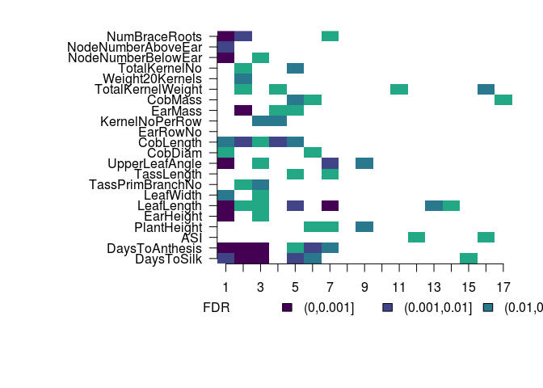
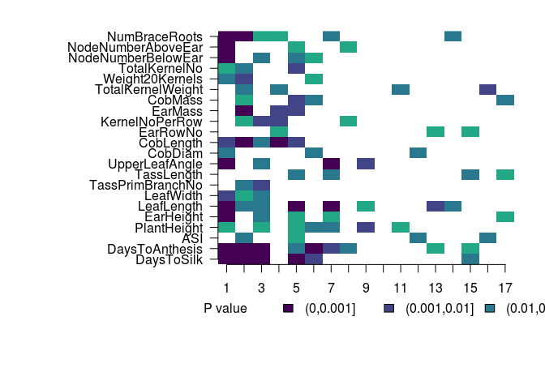

This notebook has code for running a form of Q<sub>pc</sub> analysis using the Major-Goodman GWAS panel and detecting selection in the European landraces.

# Load in the kinship matrix and make a conditional matrix 

```r
load('data/euro.282.E.rda')


sigma11 = as.matrix(myF[1:906,1:906])
sigma12 = as.matrix(myF[1:906,907:1168])
sigma21 = as.matrix(myF[907:1168,1:906])
sigma22 = as.matrix(myF[907:1168,907:1168]) #we are dropping the last row
sigma.cond = sigma11 - sigma12 %*% solve(sigma22) %*% sigma21
condEig = eigen(sigma.cond)
cEigVectors = condEig$vectors
cEigValues = condEig$values
#save(cEigVectors, cEigValues, file = 'data/euro.282.condeig.rda')

traitNames = read.table('data/blup.names', stringsAsFactors=F)$V1

niceTraitnames = sapply(traitNames, function(x){
  strsplit(x, '0607')[[1]][1]
})
```

# Calculate cutoffs for PCs

```r
#get cutoffs for pcs based on % variation explained
varexp = cEigValues/sum(cEigValues)
sumexp = sapply(1:length(varexp), function(x){sum(varexp[1:x])})
par(mfrow=c(1,2), mar=c(5,5,1,1))

#get cutoffs for how many pcs to look at
pcmax = which(sumexp > 0.30)[1]
```

# Run Qpc
The function is in qpctools/R/QpcEuro.R

```bash
cat qpctools/R/QpcEuro.R
```

```
## #' Calculate Qpc on European landraces
## #'
## #' This function calculates Qpc on European landraces.
## #' @param myI the trait number that we're looking at
## #' @param myM the number of lines in the genotyping panel
## #' @param gwasPrefix path prefix for the GWAS results
## #' @param sigPrefix path prefix for the genotypes of GWAS loci in the genotyping panel
## #' @param cutoff p value cutoff for including SNPs. Default is 1.
## #' @param mysigma the kinship matrix for the combined genotyping and GWAS panels.
## #' @param myLambda a list of eigenvalues of the conditional kinship matrix
## #' @param myU a matrix of eigenvectors of the conditional kinship matrix
## #' @export
## 
## 
## Qpceuro <- function(myI, myM = 906, cutoff=1, gwasPrefix = 'data/263-gwas-results/ldfiltered.assoc.', 
##                     sigPrefix = 'data/263-gwas-results/sigSnpsEuro.', mysigma = myF, mypcmax = pcmax,
##                     myLambda = cEigValues, myU = cEigVectors){ 
##   
## #remove the last end of PCs 
## tailCutoff = round(.9*myM)
##   
## #generate sigmas
## sigma22 = as.matrix(mysigma[(myM + 1):dim(mysigma)[1],(myM + 1):dim(mysigma)[1]])
## sigma12 = as.matrix(myF[1:myM,(myM+1):dim(mysigma)[1]])
## 
## 
## #read in data
## gwasHits = read.table(paste(gwasPrefix,myI,sep=""), stringsAsFactors=F)
## names(gwasHits) = c('x','y',strsplit('chr     rs      ps      n_miss  allele1 allele0 af      beta    se      l_remle l_mle   p_wald  p_lrt   p_score scaf', split=' +')[[1]])
## gwasHits$locus =  sapply(gwasHits$rs, function(x){paste('s',gsub(":","_",x),sep="")})
## sigGenos = read.table(paste(sigPrefix,myI, sep=""), header=T, stringsAsFactors=F)
## 
## ##filter based on p cutoff
## gwasHits = dplyr::filter(gwasHits, p_lrt < cutoff)
## 
## #combine table of GWAS results with genotypes in the GWAS set
## combInfo = dplyr::inner_join(sigGenos, gwasHits, by = c('locus'))
## combInfo$mybetas = ifelse(combInfo$allele1 == combInfo$ALT, combInfo$beta, -combInfo$beta)
## myBetas = as.matrix(combInfo$mybetas)
## 
## #center genotype matrix
## myG = t(as.matrix(combInfo[,6:1174]))
## #myG = t(as.matrix(sigGenos[,6:ncol(sigGenos)]))
## m = nrow(myG)
## myT = matrix(data = -1/m, nrow = m - 1, ncol = m)
## diag(myT) = (m - 1)/m
## myGcent = myT %*% myG
## 
## #calculate breeding values
## allZ = myGcent %*% myBetas
## z1 = allZ[1:myM]
## z2 = allZ[(myM+1):length(allZ)]
## #z2cent = z2 - mean(z2)
## zcond = mean(z1) + sigma12 %*% solve(sigma22) %*%  z2 #calculating the conditional prediction for Z
## #zcond = zcond - mean(zcond)#center zcond
## #z1 = z1 - mean(z1)
## 
## #project breeding values onto PCs and standardize
## myBm = t(z1 - zcond) %*% as.matrix(myU) #z1 - zcond is the observed - expected under conditional
## 
## #do PC specific test -- here still using Va from the loci effect sizes and frequency
## myCmprime = sapply(1:(myM-1), function(x){t(myBm[,x]/sqrt(myLambda[x]))})
## myQm = sapply(1:pcmax, function(n){
##     var0(myCmprime[n])/var0(myCmprime[(tailCutoff-50):tailCutoff])
##   })
## myPsprime = sapply(1:mypcmax, function(x){pf(myQm[x], 1, 50, lower.tail=F)})
## 
## outList = list(muprime = zcond, bv = z1, cmprime = myCmprime, pprime = myPsprime, n.sites = nrow(combInfo))
## return(outList)
## 
## }
```


```r
qpceuroOut = lapply(1:22,Qpceuro)
save(qpceuroOut, file = "data/qpc_euro_output.rda")
```

# Look at results

```r
load('data/qpc_euro_output.rda')

pcpvals = sapply(qpceuroOut, function(x) {x$pprime}) #matrix, rows are pvals, columns are traits
allqvals = get_q_values(pcpvals)

layout(matrix(1, nrow=1, ncol=1))
mysig2 =  cut((1:1000/1000), c(0,0.001,0.01,0.05,0.1,1)) #for legend
par(mar=c(8,14,2,2), xpd=TRUE, mfrow=c(1,1))
mycol = c(viridis(6, direction=1)[1:4], "white")
image(allqvals, col=mycol, xaxt="n", yaxt="n", bty="n", breaks=c(0,0.001,0.01,0.05,0.1,1))
axis(1, at=seq(0,1, length=nrow(pcpvals)), label=1:nrow(pcpvals))
axis(2, at=(0:21)/21, labels = niceTraitnames, las=2)
legend(-0.2,-0.15, c('FDR',levels(mysig2)), fill=c('white',mycol), border=c('white',rep('black',5)), bty="n", horiz=T)
```

<!-- -->

```r
image(pcpvals, col=mycol, xaxt="n", yaxt="n", bty="n", breaks=c(0,0.001,0.01,0.05,0.1,1))
axis(1, at=seq(0,1, length=nrow(pcpvals)), label=1:nrow(pcpvals))
axis(2, at=(0:21)/21, labels = niceTraitnames, las=2)
legend(-0.2,-0.15, c('P value',levels(mysig2)), fill=c('white',mycol), border=c('white',rep('black',5)), bty="n", horiz=T)
```

<!-- -->


# Running the original version of the test.
The function is in qpctools/R/Qpceuro-nocond.R

```bash
cat qpctools/R/QpcEuro-nocond.R
```

```
## #' Calculate Qpc on European landraces
## #'
## #' This function calculates Qpc on European landraces.
## #' @param myI the trait number that we're looking at
## #' @param myM the number of lines in the genotyping panel
## #' @param gwasPrefix path prefix for the GWAS results
## #' @param sigPrefix path prefix for the genotypes of GWAS loci in the genotyping panel
## #' @param cutoff p value cutoff for including SNPs. Default is 1.
## #' @param mysigma the kinship matrix for the genotyping panel.
## #' @param myLambda a list of eigenvalues of the genotyping panel kinship matrix
## #' @param myU a matrix of eigenvectors of the genotyping panel kinship matrix
## #' @export
## 
## 
## 
## Qpceuro_nocond <- function(myI, myM = 906, gwasPrefix = "data/263-gwas-results/ldfiltered.assoc.", 
##     sigPrefix = "data/263-gwas-results/sigSnpsEuro.", mysigma = euroOnlyF, 
##     mypcmax = pcmax, myU = euroOnlyeigen$vectors, myLambdas = euroOnlyeigen$values)
##   {
##   
## tailCutoff = round(0.9 * myM)
## 
## #read in data
## gwasHits = read.table(paste(gwasPrefix,myI,sep=""), stringsAsFactors=F) #gwas results
## names(gwasHits) = c('x','y',strsplit('chr     rs      ps      n_miss  allele1 allele0 af      beta    se      l_remle l_mle   p_wald  p_lrt   p_score', split=' +')[[1]])
## gwasHits$locus =  sapply(gwasHits$rs, function(x){paste('s',gsub(":","_",x),sep="")})
## sigGenos = read.table(paste(sigPrefix,myI, sep=""), header=T, stringsAsFactors=F) #genotypes of gwas snps in the European landraces
## 
## #combine table of GWAS results with genotypes in the GWAS set
## combInfo = dplyr::left_join(sigGenos, gwasHits, by = 'locus')
## combInfo$mybetas = ifelse(combInfo$allele1 == combInfo$ALT, combInfo$beta, -combInfo$beta)
## myBetas = as.matrix(combInfo$mybetas)
## myG = t(as.matrix(sigGenos[,6:(myM+5)]))
## 
## #center genotype matrix 
## m = nrow(myG)
## myT = matrix(data = -1/m, nrow = m - 1, ncol = m)
## diag(myT) = (m - 1)/m
## myGcent = myT %*% myG
## 
## #calculate breeding values
## allZ = myGcent %*% myBetas
## 
## #project breeding values onto PCs and standardize by eigenvalue
## myBm = t(allZ) %*% myU
## 
## #do Qpc
## myCmprime = sapply(1:(myM-1), function(x){t(myBm[,x]/sqrt(myLambdas[x]))})
## myQm = sapply(1:pcmax, function(n){
##     var0(myCmprime[n])/var0(myCmprime[(tailCutoff-50):tailCutoff])
##   })
## myPsprime = sapply(1:pcmax, function(x){pf(myQm[x], 1, 50, lower.tail=F)})
## 
## outList = list(cmprime = myCmprime, pprime = myPsprime, n.sites = nrow(combInfo))
## }
```


```r
#
load('data/euroOnlyK.rda')

### function for running Qpc on European polygenic scores without the conditional test
ncEuroOut = lapply(1:22,Qpceuro_nocond)
save(ncEuroOut, file="data/qpc-euro-nc.rda")
```


```r
load('data/qpc-euro-nc.rda')

### look at the output
ncpvals = sapply(ncEuroOut, function(x) {x$pprime}) #matrix, rows are pvals, columns are traits
ncqvals = get_q_values(ncpvals)

#mysig = apply(allqvals, 2, function(x){ cut(x, c(0,0.001,0.01,0.05,0.1,1), labels=F)})
mysig2 =  cut((1:1000/1000), c(0,0.001,0.01,0.05,0.1,1)) #for legend
par(mar=c(8,14,2,2), xpd=TRUE, mfrow=c(1,1))
mycol = c(viridis(6, direction=1)[1:4], "white")
image(ncqvals, col=mycol, xaxt="n", yaxt="n", bty="n", breaks=c(0,0.001,0.01,0.05,0.1,1))
axis(1, at=seq(0,1, length=nrow(ncpvals)), label=1:nrow(ncpvals))
axis(2, at=(0:21)/21, labels = niceTraitnames, las=2)
legend(-0.2,-0.15, c('FDR',levels(mysig2)), fill=c('white',mycol), border=c('white',rep('black',5)), bty="n", horiz=T)
```

<!-- -->

```r
image(ncpvals, col=mycol, xaxt="n", yaxt="n", bty="n", breaks=c(0,0.001,0.01,0.05,0.1,1))
axis(1, at=seq(0,1, length=nrow(ncpvals)), label=1:nrow(ncpvals))
axis(2, at=(0:21)/21, labels = niceTraitnames, las=2)
legend(-0.2,-0.15, c('P value',levels(mysig2)), fill=c('white',mycol), border=c('white',rep('black',5)), bty="n", horiz=T)
```

<!-- -->


# Map of the landraces

```r
#lat long plot
library(maps)
load("data/euro_qpc_data.rda")
eurodat = read.table('data/eurolandraceinfo.csv', sep=',', head=T, stringsAsFactors=F)

map("world", xlim=c(1.5*min(eurodat$Longitude),1.2*max(eurodat$Longitude)), ylim=c(0.85*min(eurodat$Latitude),1.05*max(eurodat$Latitude)), fill=T, col="azure")
points(eurodat$Longitude, eurodat$Latitude, col = magma(6)[4], lwd=4)
```

<!-- -->


