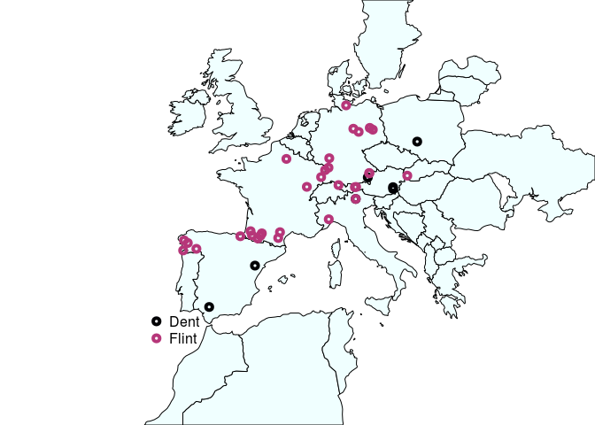
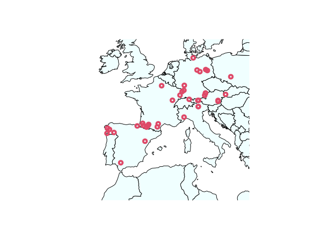
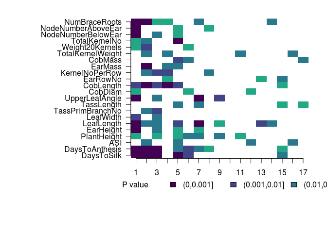

This notebook has code for running a form of Q<sub>pc</sub> analysis using the Major-Goodman GWAS panel and detecting selection in the European landraces.

# Load in the kinship matrix and make a conditional matrix 

```r
load('data/euro.282.E.rda')


sigma11 = as.matrix(myF[1:906,1:906])
sigma12 = as.matrix(myF[1:906,907:1168])
sigma21 = as.matrix(myF[907:1168,1:906])
sigma22 = as.matrix(myF[907:1168,907:1168]) #we are dropping the last row
sigma.cond = sigma11 - sigma12 %*% solve(sigma22) %*% sigma21
condEig = eigen(sigma.cond)
cEigVectors = condEig$vectors
cEigValues = condEig$values
#save(cEigVectors, cEigValues, file = 'data/euro.282.condeig.rda')

traitNames = read.table('data/blup.names', stringsAsFactors=F)$V1

niceTraitnames = sapply(traitNames, function(x){
  strsplit(x, '0607')[[1]][1]
})
```

# Calculate cutoffs for PCs

```r
#get cutoffs for pcs based on % variation explained
varexp = cEigValues/sum(cEigValues)
sumexp = sapply(1:length(varexp), function(x){sum(varexp[1:x])})
par(mfrow=c(1,2), mar=c(5,5,1,1))

#get cutoffs for how many pcs to look at
pcmax = which(sumexp > 0.30)[1]
```

# Run Qpc
The function is in qpctools/R/Qpceuro

```r
qpceuroOut = lapply(1:22,Qpceuro)
save(qpceuroOut, file = "data/qpc_euro_output.rda")
```

# Look at results

```r
load('data/qpc_euro_output.rda')

pcpvals = sapply(qpceuroOut, function(x) {x$pprime}) #matrix, rows are pvals, columns are traits
allqvals = get_q_values(pcpvals)

layout(matrix(1, nrow=1, ncol=1))
mysig2 =  cut((1:1000/1000), c(0,0.001,0.01,0.05,0.1,1)) #for legend
par(mar=c(8,14,2,2), xpd=TRUE, mfrow=c(1,1))
mycol = c(viridis(6, direction=1)[1:4], "white")
image(allqvals, col=mycol, xaxt="n", yaxt="n", bty="n", breaks=c(0,0.001,0.01,0.05,0.1,1))
axis(1, at=seq(0,1, length=nrow(pcpvals)), label=1:nrow(pcpvals))
axis(2, at=(0:21)/21, labels = niceTraitnames, las=2)
legend(-0.2,-0.15, c('FDR',levels(mysig2)), fill=c('white',mycol), border=c('white',rep('black',5)), bty="n", horiz=T)
```

<!-- -->

```r
image(pcpvals, col=mycol, xaxt="n", yaxt="n", bty="n", breaks=c(0,0.001,0.01,0.05,0.1,1))
axis(1, at=seq(0,1, length=nrow(pcpvals)), label=1:nrow(pcpvals))
axis(2, at=(0:21)/21, labels = niceTraitnames, las=2)
legend(-0.2,-0.15, c('P value',levels(mysig2)), fill=c('white',mycol), border=c('white',rep('black',5)), bty="n", horiz=T)
```

<!-- -->


# Where are landraces from

```r
#lat long plot
library(maps)
load("data/euro_qpc_data.rda")
eurodat = read.table('data/eurolandraceinfo.csv', sep=',', head=T, stringsAsFactors=F)

map("world", xlim=c(1.5*min(eurodat$Longitude),1.2*max(eurodat$Longitude)), ylim=c(0.85*min(eurodat$Latitude),1.05*max(eurodat$Latitude)), fill=T, col="azure")
points(eurodat$Longitude, eurodat$Latitude, col = magma(6)[4], lwd=4)
```

<!-- -->

```r
palette(magma(3))
par(xpd=TRUE)
map("world", xlim=c(1.5*min(eurodat$Longitude),1.2*max(eurodat$Longitude)), ylim=c(0.9*min(eurodat$Latitude),1.05*max(eurodat$Latitude)), fill=T, col="azure")
points(eurodat$Longitude, eurodat$Latitude, col = as.factor(eurodat$Type), lwd=4)
legend('bottomleft', levels(as.factor(eurodat$Type)), col = as.factor(eurodat$Type), pch=1, pt.lwd=4, bty="n")
```

<!-- -->


# Running the original version of the test.
The function is in qpctools/R/Qpceuro-nocond.R

```r
#
load('data/euroOnlyK.rda')

### function for running Qpc on European polygenic scores without the conditional test
ncEuroOut = lapply(1:22,Qpceuro_nocond)
save(ncEuroOut, file="data/qpc-euro-nc.rda")
```


```r
load('data/qpc-euro-nc.rda')

### look at the output
ncpvals = sapply(ncEuroOut, function(x) {x$pprime}) #matrix, rows are pvals, columns are traits
ncqvals = get_q_values(ncpvals)

#mysig = apply(allqvals, 2, function(x){ cut(x, c(0,0.001,0.01,0.05,0.1,1), labels=F)})
mysig2 =  cut((1:1000/1000), c(0,0.001,0.01,0.05,0.1,1)) #for legend
par(mar=c(8,14,2,2), xpd=TRUE, mfrow=c(1,1))
mycol = c(viridis(6, direction=1)[1:4], "white")
image(ncqvals, col=mycol, xaxt="n", yaxt="n", bty="n", breaks=c(0,0.001,0.01,0.05,0.1,1))
axis(1, at=seq(0,1, length=nrow(ncpvals)), label=1:nrow(ncpvals))
axis(2, at=(0:21)/21, labels = niceTraitnames, las=2)
legend(-0.2,-0.15, c('FDR',levels(mysig2)), fill=c('white',mycol), border=c('white',rep('black',5)), bty="n", horiz=T)
```

<!-- -->

```r
image(ncpvals, col=mycol, xaxt="n", yaxt="n", bty="n", breaks=c(0,0.001,0.01,0.05,0.1,1))
axis(1, at=seq(0,1, length=nrow(ncpvals)), label=1:nrow(ncpvals))
axis(2, at=(0:21)/21, labels = niceTraitnames, las=2)
legend(-0.2,-0.15, c('P value',levels(mysig2)), fill=c('white',mycol), border=c('white',rep('black',5)), bty="n", horiz=T)
```

<!-- -->

