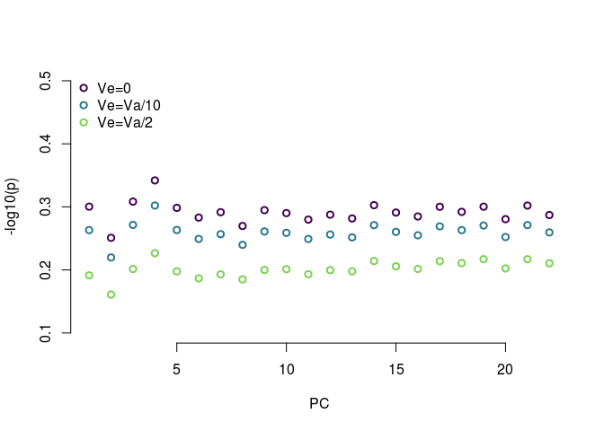

This notebook has code for running simulations for Q<sub>pc</sub> analysis in a GWAS panel of 240 maize lines and Q<sub>xpc</sub> on Ames and European lines.


###Q<sub>pc</sub> simulations:


```r
#read in kinship data
myK = read.table('data/All_240E.nomaf.nomissing.K')
myKnames = read.table('data/240.names', stringsAsFactors = F)$V1 #get individual names
row.names(myK) = myKnames[1:dim(myK)[1]]

#eigendecomposition of the kinship matrix
eigF = eigen(myK)
myU = eigF$vectors
myLambdas = eigF$values

#get test cutoffs
varexp = myLambdas/sum(myLambdas)
sumexp = sapply(1:length(varexp), function(x){sum(varexp[1:x])})
pcmax = which(sumexp > 0.3)[1]
tailCutoff = round(.9*length(myLambdas))
```


```r
#function for calculating Qm
calcQm <- function(myZ=MyZneutral, myU=eigF$vectors, myLambdas=eigF$values){
  myZ = myZ[1:dim(myU)[1]] - mean(myZ)
  myCm = (myZ %*% myU)/sqrt(myLambdas)
  myQm = sapply(1:pcmax, function(n){
    var0(myCm[n])/var0(myCm[(tailCutoff-50):tailCutoff])
  })
  myPs = sapply(1:pcmax, function(x){pf(myQm[x], 1, 50, lower.tail=F)})
  retdf = list(qm = myQm, pvals = myPs, cm = t(myCm),stringsAsFactors = F)
  return(retdf)
}

#simulate traits with neutrality and varying amounts of Va. Run this once and save output to save time.
neutQpc <- function(myK,myU,myLambdas, myseed=1,myVa=1, myVe=0){
set.seed(myseed)
myZneutral = mvrnorm(n=1, rep(0,dim(myK)[1]), myVa*myK + myVe*diag(dim(myK)[1])) #neutral traits
myQmneutral = calcQm(myZneutral, myU, myLambdas)
return(myQmneutral)
}
neutQpcVe0 = lapply(1:200, function(x){neutQpc(myK, myU, myLambdas, myseed=x, myVa=1, myVe=0)})#no Ve
neutQpcVe.1 = lapply(1:200, function(x){neutQpc(myK, myU, myLambdas, myseed=x,myVa=1, myVe=.1)}) #Ve = Va/10
neutQpcVe.5 = lapply(1:200, function(x){neutQpc(myK, myU, myLambdas, myseed=x,myVa=1, myVe=.5)}) #Ve = Va/2

save(neutQpcVe0,neutQpcVe.1,neutQpcVe.5, tailCutoff, pcmax, file="data/simFiles/Qpc200.rda")
```

We can measure false positives using the variance of C values (which we expect to be Va under neutrality, which has been set as 1 here)

```r
load('data/simFiles/Qpc200.rda')
mycol = viridis(6)

#no Ve
allCms = sapply(neutQpcVe0, function(x) {x$cm}) #matrix where columns are the Cm values for a given simulation (from PC1 to PC 239)
allCmVars = apply(allCms, 1, var0) #get variance across all 200 sims for each pc
plot(allCmVars[1:tailCutoff], bty="n", col = mycol[1], lwd=2, xlab = 'PC', ylab = "var(Cm) with no Ve", xlim = c(0,tailCutoff))
```

<!-- -->

```r
allPs = sapply(neutQpcVe0, function(x) {x$pvals}) #matrix where columns are the Cm values for a given simulation (from PC1 to PC 239)

count_sig = sapply(1:pcmax, function(x){sum(allPs[x,]<=0.05)})
```

Without any V<sub>e</sub>, the variance of C<sub>m<sub> is centered around 1, as expected under neutrality. What happpens when we add V<sub>e</sub>?


```r
#adding Ve
allCmsVe.1 = sapply(neutQpcVe.1, function(x) {x$cm})
allCmVarsVe.1 = apply(allCmsVe.1, 1, var0) #get variance across all 200 sims for each pc
allCmsVe.5 = sapply(neutQpcVe.5, function(x) {x$cm})
allCmVarsVe.5 = apply(allCmsVe.5, 1, var0) #get variance across all 200 sims for each pc

plot(allCmVarsVe.5[1:tailCutoff], bty="n", col = mycol[1], lwd=2, xlab = 'PC', ylab = "var(Cm)", xlim = c(0, tailCutoff), ylim=c(0,3.5))
points(allCmVarsVe.1[1:tailCutoff], col = mycol[3], lwd=2)
points(allCmVars[1:tailCutoff], col = mycol[5], lwd=2)
legend('topleft', c('Ve=0','Ve=Va/10','Ve=Va/2'), col = mycol[c(5,3,1)], pch=1, bty="n", pt.lwd=2)
```

<!-- -->

Adding V<sub>e</sub> increases the variance of Cm at increasingly large scales. This will make our test conservative. We can see how conservative but calculating the average P value across tests. 


```r
#testing for selection on early PCs
allPs = sapply(neutQpcVe0, function(x){x$pvals})
meanPs = apply(allPs, 1, mean)
allPsVe.1 = sapply(neutQpcVe.1, function(x){x$pvals})
meanPsVe.1 = apply(allPsVe.1, 1, mean)
allPsVe.5 = sapply(neutQpcVe.5, function(x){x$pvals})
meanPsVe.5 = apply(allPsVe.5, 1, mean)

plot(-log10(meanPs), col = mycol[1], bty="n", xlab = "PC", ylab = "-log10(p)", ylim=c(0.1,0.5), lwd=2)
points(-log10(meanPsVe.1), col=mycol[3], lwd=2)
points(-log10(meanPsVe.5), col=mycol[5], lwd=2)
legend('topleft', c('Ve=0','Ve=Va/10','Ve=Va/2'), col = mycol[c(1,3,5)], pch=1, bty="n", pt.lwd=2)
```

<!-- -->

