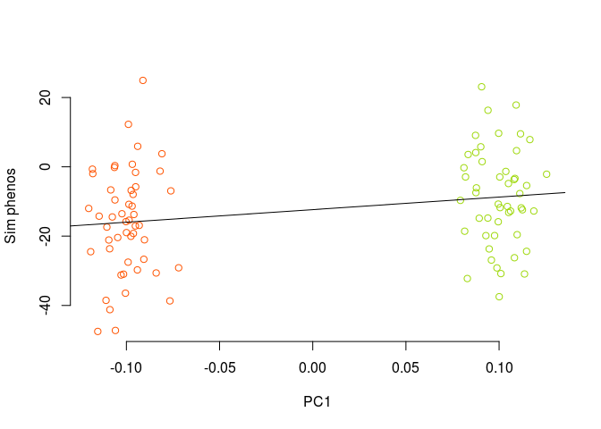
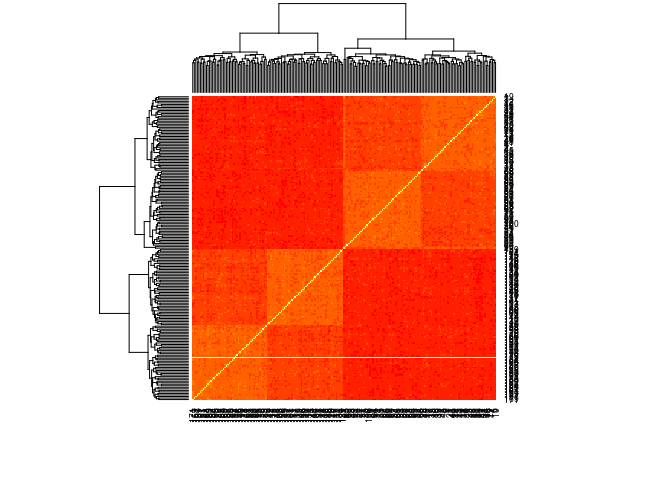
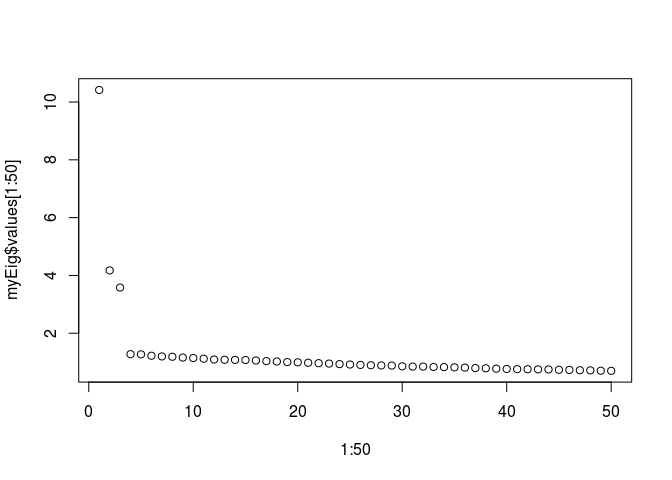
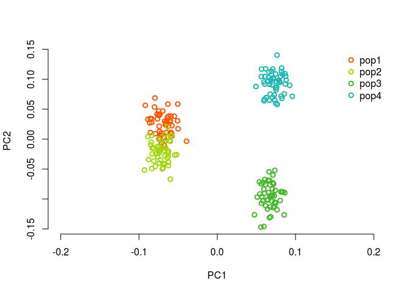
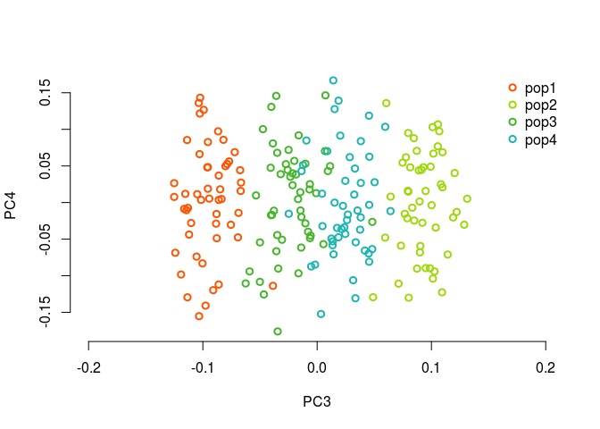

Simulate two populations of maize under mvn


```r
i=1
x1 <- runif(1) #getting a random number so there's a seed
save(".Random.seed", file=paste("data/figure_sims/randomSeed.",i, sep=""))

Faa = 0.15

#we want 100 individuals, 50 in each pop, so sigma is...
#sigma = matrix(0,nrow=100, ncol=100)
#sigma[1:50,1:50] = matrix(Faa, nrow=50,ncol=50)
#sigma[51:100,51:100] = matrix(Faa, nrow=50,ncol=50)
#diag(sigma) = 0.3
sigma = matrix(c(Faa,0,0,Faa),nrow=2, ncol=2)


#simulate allele freqs in two pops at these loci
nloci = 500
ancPop = runif(nloci, min=0, max=1)
presentPops1 = sapply(ancPop, function(x){mvrnorm(n=1, mu = rep(x,2), x*(1-x)*sigma)})
presentPops = apply(presentPops1, c(1,2), myBound) #deal with numbers greater or less than 0 (the outer bounds are sticky)

#plot(ancPop, bty='n', xlab = "locus", ylab = "p")
#sapply(1:100, function(x){lines(c(x,x), c(presentPops[1,x], presentPops[2,x]))})

#get the population genotypes
npop = 50
popGenos = lapply(1:2, function(x) getPopGenos(x, presentPops, npop)) #a list of 2 elements, each is a population

#make a kinship matrix
myG = rbind(popGenos[[1]], popGenos[[2]])/2
myK = make_k(myG)
heatmap(myK)
```

<!-- -->

```r
myEig = eigen(myK)

mycol = lacroix_palette('Mango')[1:4]
plot(1:50,myEig$values[1:50])
```

<!-- -->

```r
plot(myEig$vectors[,1], myEig$vectors[,2], col = c(rep(mycol[1], 50),rep(mycol[2], 50)), bty='n', xlab= 'PC1', ylab = 'PC2', lwd=2, xlim = c(-.2, .2))
legend('topright', c('pop1','pop2'), bty="n", pch=1, pt.lwd=2, col = mycol)
```

<!-- -->

What if I do 4 populations, like in my talks?


```r
i=1
x1 <- runif(1) #getting a random number so there's a seed
save(".Random.seed", file=paste("data/figure_sims/randomSeed.",i, sep=""))

npops=4
Faa = 0.15

sigma = matrix(0,nrow=4, ncol=4)
sigma[1:2,1:2] = matrix(Faa/2, nrow=2, ncol=2)
sigma[3:4,3:4] = sigma[1:2,1:2]
diag(sigma) = Faa
library(viridis)
```

```
## Loading required package: viridisLite
```

```r
heatmap(sigma, col = viridis(4))
```

<!-- -->

```r
#simulate allele freqs in two pops at these loci
nloci = 500
ancPop = runif(nloci, min=0, max=1)
presentPops1 = sapply(ancPop, function(x){mvrnorm(n=1, mu = rep(x,npops), x*(1-x)*sigma)})
presentPops = apply(presentPops1, c(1,2), myBound) #deal with numbers greater or less than 0 (the outer bounds are sticky)

#plot(ancPop, bty='n', xlab = "locus", ylab = "p")
#sapply(1:100, function(x){lines(c(x,x), c(presentPops[1,x], presentPops[2,x]))})

#get the population genotypes
npop = 50
popGenos = lapply(1:npops, function(x) getPopGenos(x, presentPops, npop)) #a list of elements, each is a population

#make a kinship matrix
myG = rbind(popGenos[[1]], popGenos[[2]], popGenos[[3]], popGenos[[4]])/2
myK = make_k(myG)
heatmap(myK)
```

<!-- -->

```r
myEig = eigen(myK)

mycol = lacroix_palette('Mango')[1:4]
plot(1:50,myEig$values[1:50])
```

<!-- -->

```r
plot(myEig$vectors[,1], myEig$vectors[,2], col = c(rep(mycol[1], 50),rep(mycol[2], 50), rep(mycol[3], 50), rep(mycol[4], 50)), bty='n', xlab= 'PC1', ylab = 'PC2', lwd=2, xlim = c(-.2, .2))
legend('topright', c('pop1','pop2', 'pop3','pop4'), bty="n", pch=1, pt.lwd=2, col = mycol)
```

<!-- -->

```r
plot(myEig$vectors[,3], myEig$vectors[,4], col = c(rep(mycol[1], 50),rep(mycol[2], 50), rep(mycol[3], 50), rep(mycol[4], 50)), bty='n', xlab= 'PC3', ylab = 'PC4', lwd=2, xlim = c(-.2, .2))
legend('topright', c('pop1','pop2', 'pop3','pop4'), bty="n", pch=1, pt.lwd=2, col = mycol)
```

<!-- -->

TODO: make y axis the phenotype
beetas = matrix(c(rnorm(opt$loci/2),rep(0,opt$loci/2)), ncol=1, nrow=opt$loci) #half are 0, half are from a normal distribution

if (opt$environmental_shift == TRUE){pop.phenos = myShift(pop.phenos)}

#individual noise shifts
#if (opt$noise == TRUE){pop.phenos = lapply(pop.phenos, function(x){jitter(x, factor=50)})}
if (opt$noise == TRUE){
pop.phenos = lapply(pop.phenos, function(x){x + rnorm(length(x), mean=0, sd=sd(x)/2 )})  
}
pop.phenos = getPopPhenos(pop.genos, beetas)


