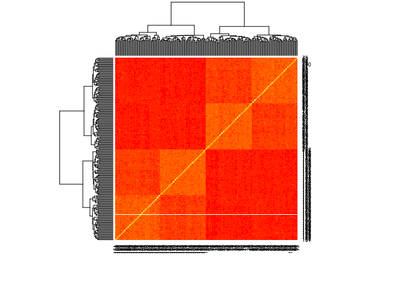
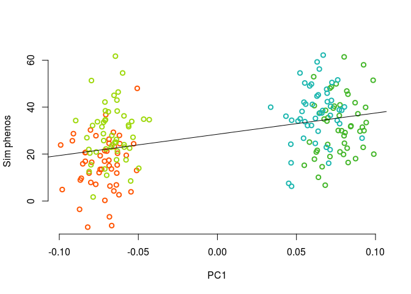
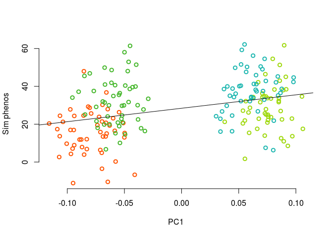
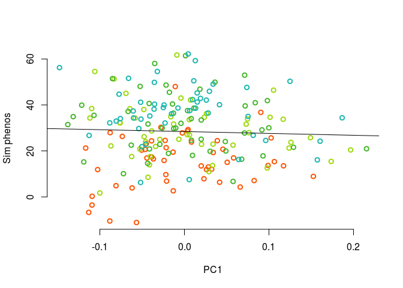
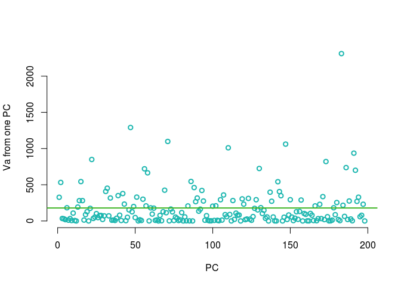

What if I do 4 populations, like in my talks?


```r
i=1
x1 <- runif(1) #getting a random number so there's a seed
save(".Random.seed", file=paste("data/figure_sims/randomSeed.",i, sep=""))

npops=4
Faa = 0.15

sigma = matrix(0,nrow=4, ncol=4)
sigma[1:2,1:2] = matrix(Faa/2, nrow=2, ncol=2)
sigma[3:4,3:4] = sigma[1:2,1:2]
diag(sigma) = Faa
library(viridis)
```

```
## Loading required package: viridisLite
```

```r
heatmap(sigma, col = viridis(4))
```

<!-- -->

```r
#simulate allele freqs in two pops at these loci
nloci = 500
ancPop = runif(nloci, min=0, max=1)
presentPops1 = sapply(ancPop, function(x){mvrnorm(n=1, mu = rep(x,npops), x*(1-x)*sigma)})
presentPops = apply(presentPops1, c(1,2), myBound) #deal with numbers greater or less than 0 (the outer bounds are sticky)

#plot(ancPop, bty='n', xlab = "locus", ylab = "p")
#sapply(1:100, function(x){lines(c(x,x), c(presentPops[1,x], presentPops[2,x]))})

#get the population genotypes
npop = 50
popGenos = lapply(1:npops, function(x) getPopGenos(x, presentPops, npop)) #a list of elements, each is a population

#make a kinship matrix
myG = rbind(popGenos[[1]], popGenos[[2]], popGenos[[3]], popGenos[[4]])/2
myK = make_k(myG)
heatmap(myK)
```

<!-- -->

```r
myEig = eigen(myK)

mycol = lacroix_palette('Mango')[1:4]
#plot(1:50,myEig$values[1:50])
#plot(myEig$vectors[,1], myEig$vectors[,2], col = c(rep(mycol[1], 50),rep(mycol[2], 50), rep(mycol[3], 50), rep(mycol[4], 50)), bty='n', xlab= 'PC1', ylab = 'PC2', lwd=2, xlim = c(-.2, .2))
#legend('topright', c('pop1','pop2', 'pop3','pop4'), bty="n", pch=1, pt.lwd=2, col = mycol)

#plot(myEig$vectors[,3], myEig$vectors[,4], col = c(rep(mycol[1], 50),rep(mycol[2], 50), rep(mycol[3], 50), rep(mycol[4], 50)), bty='n', xlab= 'PC3', ylab = 'PC4', lwd=2, xlim = c(-.2, .2))
#legend('topright', c('pop1','pop2', 'pop3','pop4'), bty="n", pch=1, pt.lwd=2, col = mycol)

beetas = matrix(c(rnorm(nloci)), ncol=1, nrow=nloci) 
popPhenos = getPopPhenos(popGenos, beetas)
#individual noise shifts
#popPhenosNoise = lapply(popPhenos, function(x){x + rnorm(length(x), mean=0, sd=sd(x)/2 )})

#plot(popPhenos[[1]], popPhenosNoise[[1]])


#myPhenos = unlist(popPhenosNoise)
myPhenos = unlist(popPhenos)
plot(myEig$vectors[,1], myPhenos[1:199], col = c(rep(mycol[1], 50),rep(mycol[2], 50), rep(mycol[3], 50), rep(mycol[4], 50)), bty="n", xlab = "PC1", ylab ="Sim phenos", lwd=2)
myl = lm(myPhenos[1:199]~ myEig$vectors[,1])
abline(myl)
```

<!-- -->

```r
plot(myEig$vectors[,2], myPhenos[1:199], col = c(rep(mycol[1], 50),rep(mycol[2], 50), rep(mycol[3], 50), rep(mycol[4], 50)), bty="n", xlab = "PC1", ylab ="Sim phenos", lwd=2)
myl = lm(myPhenos[1:199]~ myEig$vectors[,2])
abline(myl)
```

<!-- -->

```r
plot(myEig$vectors[,3], myPhenos[1:199], col = c(rep(mycol[1], 50),rep(mycol[2], 50), rep(mycol[3], 50), rep(mycol[4], 50)), bty="n", xlab = "PC1", ylab ="Sim phenos",lwd=2)
myl = lm(myPhenos[1:199]~ myEig$vectors[,3])
abline(myl)
```

<!-- -->

```r
plot(myEig$vectors[,4], myPhenos[1:199], col = c(rep(mycol[1], 50),rep(mycol[2], 50), rep(mycol[3], 50), rep(mycol[4], 50)), bty="n", xlab = "PC1", ylab ="Sim phenos", lwd=2)
myl = lm(myPhenos[1:199]~ myEig$vectors[,4])
abline(myl)
```

<!-- -->


Now to show how we're estimating Va with the lower pcs


```r
## estimate Va with the loci and allele freqs
myPs =  colMeans(presentPops) #get allele freq across all pops (could do with anc pop too)
myVaGeno = calcVa(myPs, beetas)
myVaGeno
```

```
## [1] 157.0441
```

```r
myVaAnc = calcVa(ancPop, beetas)
myVaAnc
```

```
## [1] 161.6824
```

```r
#estimate Va with all PCs
ninds = npops*npop - 1
myCs = sapply(1:ninds, function(x){
  (myPhenos[1:ninds] %*% myEig$vectors[,x])/sqrt(myEig$values[x])
}) #project traits onto PCs


myVaAll = var0(myCs[1:198])/2
myVaAll 
```

```
## [1] 179.3133
```

```r
#plot Va estimates
myVaPC = sapply(myCs[1:198], var0)/2
hist(myVaPC, col = mycol[4], border="white", main = "") ##this is the right distribution, right?
```

<!-- -->

```r
plot(myVaPC, bty="n", lwd=2, col = mycol[4], xlab = 'PC', ylab = "Va from one PC")
abline(h=myVaAll, col = mycol[3], lwd=2)
```

<!-- -->

```r
summary(myVaPC)
```

```
##      Min.   1st Qu.    Median      Mean   3rd Qu.      Max. 
##    0.0023   12.3227   79.4457  179.3133  249.2019 2311.4643
```

