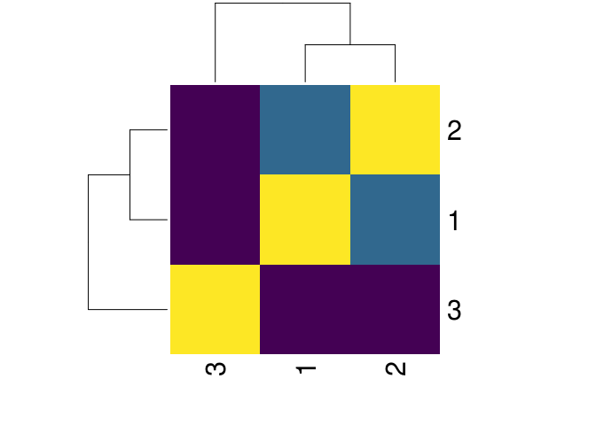
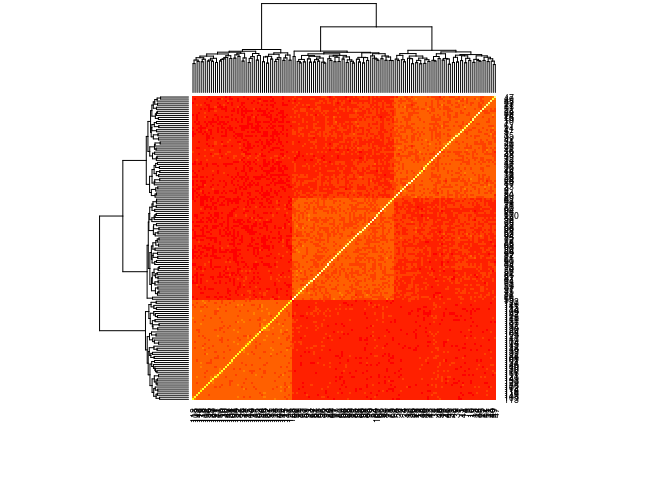
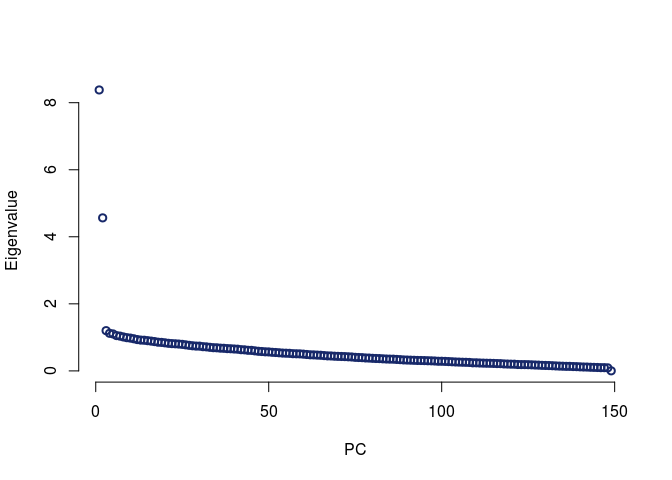
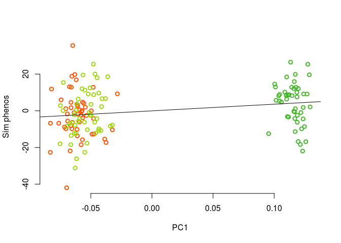
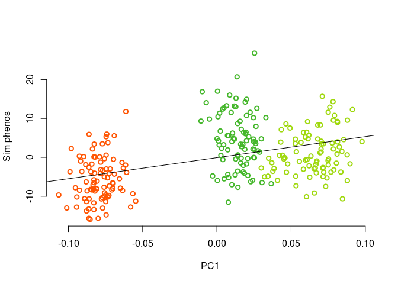
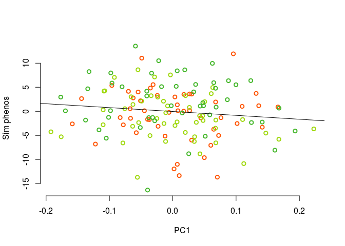
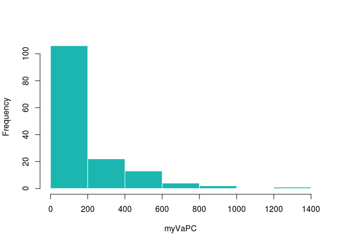
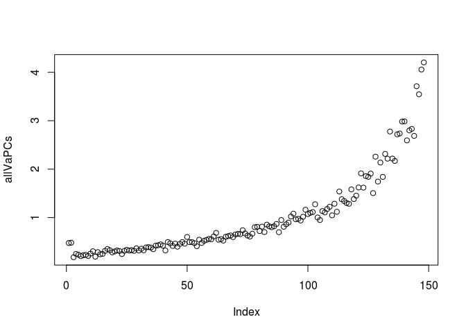

3 populations


```r
#i=1
#x1 <- runif(1) #getting a random number so there's a seed
#save(".Random.seed", file=paste("data/figure_sims/randomSeed.",i, sep=""))
load('data/figure_sims/randomSeed.1')

npops=3
Faa = 0.15

sigma = matrix(0,nrow=3, ncol=3)
sigma[1:2,1:2] = matrix(Faa/2, nrow=2, ncol=2)
diag(sigma) = Faa
library(viridis)
```

```
## Loading required package: viridisLite
```

```r
heatmap(sigma, col = viridis(4))
```

<!-- -->

```r
sigma2 = matrix(0, nrow=9, ncol=9)

for (x in 0:2){
 sigma2[(1:3)+x*3,(1:3)+x*3] = sigma + sigma[x+1,x+1]
  }
sigma2[4:6,1:3] = 0.075
sigma2[1:3,4:6] = 0.075


#simulate allele freqs in pops at these loci
nloci = 500
ancPop = runif(nloci, min=0, max=1)
presentPops1 = sapply(ancPop, function(x){mvrnorm(n=1, mu = rep(x,npops*3), x*(1-x)*sigma2)})
presentPops = apply(presentPops1, c(1,2), myBound) #deal with numbers greater or less than 0 (the outer bounds are sticky)

#get the population genotypes
npop = 30
popGenos = lapply(1:(npops*3), function(x) getPopGenos(x, presentPops, npop)) #a list of elements, each is a population

#make a kinship matrix with the last 400 sites
myG = do.call(rbind, lapply(popGenos, function(x){x[,101:500]}))
myK = make_k(myG/2)
heatmap(myK)
```

<!-- -->

```r
myEig = eigen(myK)

mycol = lacroix_palette('Mango')
plot(myEig$values, lwd=2, bty="n", col = mycol[6], xlab = "PC", ylab = "Eigenvalue")
```

<!-- -->

```r
beetas = matrix(c(rnorm(100), rep(0, 400)), ncol=1, nrow=nloci) 
popPhenos = getPopPhenos(popGenos, beetas)

nind = npops*3*npop - 1
#myPhenos = unlist(popPhenosNoise)
myPhenos = unlist(popPhenos) - mean(unlist(popPhenos))
plot(myEig$vectors[,1], myPhenos[1:nind], col = c(rep(mycol[1], 90),rep(mycol[2], 90), rep(mycol[3], 90)), bty="n", xlab = "PC1", ylab ="Sim phenos", lwd=2)
myl = lm(myPhenos[1:nind]~ myEig$vectors[,1])
abline(myl)
```

<!-- -->

```r
plot(myEig$vectors[,2], myPhenos[1:nind], col = c(rep(mycol[1], 90),rep(mycol[2], 90), rep(mycol[3], 90)), bty="n", xlab = "PC1", ylab ="Sim phenos", lwd=2)
myl = lm(myPhenos[1:nind]~ myEig$vectors[,2])
abline(myl)
```

<!-- -->

```r
plot(myEig$vectors[,3], myPhenos[1:nind], col = c(rep(mycol[1], 90),rep(mycol[2], 90), rep(mycol[3], 90)), bty="n", xlab = "PC1", ylab ="Sim phenos",lwd=2)
myl = lm(myPhenos[1:nind]~ myEig$vectors[,3])
abline(myl)
```

<!-- -->


Now to show how we're estimating Va with the lower pcs


```r
## estimate Va with the loci and allele freqs
myPs =  colMeans(presentPops) #get allele freq across all pops (could do with anc pop too)
myVaGeno = calcVa(myPs, beetas)
myVaGeno
```

```
## [1] 41.53818
```

```r
myVaAnc = calcVa(ancPop, beetas)
myVaAnc
```

```
## [1] 40.94271
```

```r
#estimate Va with all PCs
myCs = sapply(1:nind, function(x){
  (myPhenos[1:nind] %*% myEig$vectors[,x])/sqrt(myEig$values[x])
}) #project traits onto PCs


myVaAll = var0(myCs[1:(nind-1)])
myVaAll 
```

```
## [1] 245.7455
```

```r
#plot Va estimates
myVaPC = sapply(myCs[1:(nind-1)], var0)
#hist(myVaPC, col = mycol[4], border="white", main = "") ##this is the right distribution, right?

plot(myVaPC, bty="n", lwd=2, col = mycol[4], xlab = 'PC', ylab = "Va from one PC")
abline(h=myVaAll, col = mycol[3], lwd=2)
```

<!-- -->

```r
summary(myVaPC)
```

```
##    Min. 1st Qu.  Median    Mean 3rd Qu.    Max. 
##    0.00   16.37   54.46  245.75  196.74 4030.74
```


Do simulations

```r
i=2

doSim <- function(i){
x1 <- runif(i) #getting a random number so there's a seed
save(".Random.seed", file=paste("data/figure_sims/randomSeed.",i, sep=""))

npops=3
Faa = 0.15

sigma = matrix(0,nrow=3, ncol=3)
sigma[1:2,1:2] = matrix(Faa/2, nrow=2, ncol=2)
diag(sigma) = Faa
sigma2 = matrix(0, nrow=9, ncol=9)

for (x in 0:2){
 sigma2[(1:3)+x*3,(1:3)+x*3] = sigma + sigma[x+1,x+1]
  }
sigma2[4:6,1:3] = 0.075
sigma2[1:3,4:6] = 0.075

#simulate allele freqs in pops at these loci
nloci = 500
nlocitrait = 100
ancPop = runif(nloci, min=0, max=1)
presentPops1 = sapply(ancPop, function(x){mvrnorm(n=1, mu = rep(x,npops*3), x*(1-x)*sigma2)})
presentPops = apply(presentPops1, c(1,2), myBound) #deal with numbers greater or less than 0 (the outer bounds are sticky)

#get the population genotypes
npop = 30
popGenos = lapply(1:(npops*3), function(x) getPopGenos(x, presentPops, npop)) #a list of elements, each is a population

#make a kinship matrix with the last 400 sites
myG = do.call(rbind, lapply(popGenos, function(x){x[,101:500]}))
myK = make_k(myG/2)

myEig = eigen(myK)

beetas = matrix(c(rnorm(nlocitrait), rep(0, nloci-nlocitrait)), ncol=1, nrow=nloci) 
popPhenos = getPopPhenos(popGenos, beetas)

myPhenos = unlist(popPhenos) - mean(unlist(popPhenos))

myPs =  colMeans(presentPops) #get allele freq across all pops (could do with anc 
myVaGeno = calcVa(myPs, beetas)
myVaAnc = calcVa(ancPop, beetas)

#estimate Va with all PCs
ninds = npops*npop*3 - 1
myCs = sapply(1:ninds, function(x){
  (myPhenos[1:ninds] %*% myEig$vectors[,x])/sqrt(myEig$values[x])
}) #project traits onto PCs


myVaAll = var0(myCs[1:(ninds-1)])
myVaPC = sapply(myCs[1:(ninds-1)], var0)

return(list(vapc = myVaPC, vaanc = myVaAnc, vageno = myVaGeno, vaall = myVaAll))
}

vaSims = sapply(2:202, doSim)
save(vaSims, file = "data/figure_sims/vaSimresults")
```

Look at sims

```r
load('data/figure_sims/vaSimresults')

#plot out the mean Va for each PC across all PCs, divided by what you'd get for total
allVaPCs = rowMeans(sapply(1:200, function(x){vaSims[,x]$vapc/vaSims[,x]$vaall}))

plot(allVaPCs)
```

<!-- -->

```r
plot(allVaPCs[1:50])
```

<!-- -->

So what does the final figure look like??


```r
postscript("conceptfigure.eps",height=5,width=10,paper="special",horizontal=FALSE,colormodel="cymk")
par(mfrow=c(1,4), mar = c(5,5,2,2), cex.lab = 1.5, cex.axis=1.5)
myPhenos = unlist(popPhenos) - mean(unlist(popPhenos))

plot(myEig$vectors[,1], myPhenos[1:ninds], col = c(rep(mycol[1], 90),rep(mycol[2], 90), rep(mycol[3], 90)), bty="n", xlab = "PC1", ylab ="Trait", lwd=2)
myl = lm(myPhenos[1:ninds]~ myEig$vectors[,1])
abline(myl, lwd=2, col = mycol[5])


plot(myEig$vectors[,2], myPhenos[1:ninds],  col = c(rep(mycol[1], 90),rep(mycol[2], 90), rep(mycol[3], 90)), bty="n", xlab = "PC1", ylab ="Trait", lwd=2)
myl = lm(myPhenos[1:ninds]~ myEig$vectors[,2])
abline(myl, lwd=2, col = mycol[5])


plot(myEig$vectors[,3], myPhenos[1:ninds],  col = c(rep(mycol[1], 90),rep(mycol[2], 90), rep(mycol[3], 90)),  bty="n", xlab = "PC1", ylab ="Trait",lwd=2)
myl = lm(myPhenos[1:ninds]~ myEig$vectors[,3])
abline(myl, lwd=2, col = mycol[5])


plot(allVaPCs, bty="n", lwd=2, col = mycol[4], xlab = "PC", ylab = "Estimated Va")

dev.off()
```

TODO add CIs
