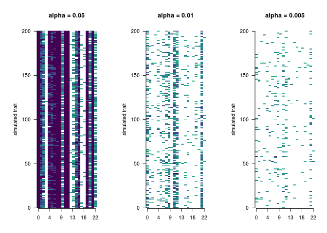
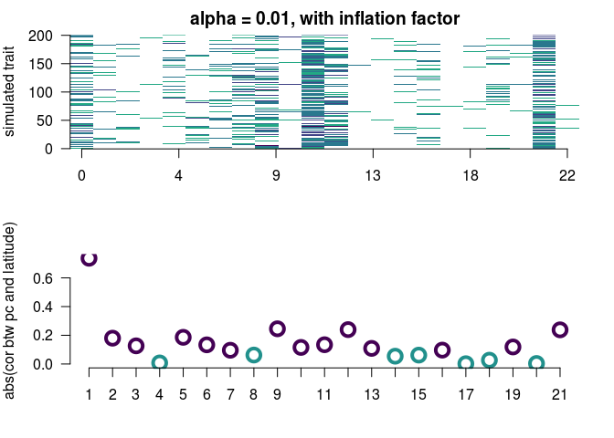

Doing power simulations where we add selection along a latitudinal gradient.

First need to make new allele frequencies at GWAS-detected SNPs that include selection. 

```r
#load in data
myI = 1
myalpha = 0.01
gwasPrefix = 'data/simFiles/ldfiltered.euro.assoc.'
genoPrefix = 'data/simFiles/sigSnps.euro.'

add_selection_to_pop <- function(pop, latitude, alpha, betas, genicVar){ #alpha is strength of selection, locus is a list of allele frequencies, latitude
  popfreqs = as.matrix(pop[-1])
  newfreq = popfreqs +  latitude * t(as.matrix(betas)) * alpha * genicVar
  boundedfreq = sapply(newfreq, myBound2)
  return(boundedfreq)
  }

myBound2 = function(x){
if (x>2) {x=2}
if (x<0) {x=0}
  return(x)
}

#myalpha = 0.001
getSelFreqs <- function(myI, myalpha = 0.01){
gwasHits = read.table(paste(gwasPrefix,myI,sep=""), stringsAsFactors=F)
names(gwasHits) = c('x','y',strsplit('chr     rs      ps      n_miss  allele1 allele0 af      beta    se      l_remle l_mle   p_wald  p_lrt   p_score', split=' +')[[1]])
gwasHits$locus =  sapply(gwasHits$rs, function(x){paste('s',gsub(":","_",x),sep="")})
sigGenos = read.table(paste(genoPrefix,myI, sep=""), header=T, stringsAsFactors=F)
combInfo = dplyr::left_join(sigGenos, gwasHits, by = 'locus')
combInfo$mybetas = ifelse(combInfo$allele1 == combInfo$ALT, combInfo$beta, -combInfo$beta)

#group genotypes by landrace and calculate mean alternate copy number
eurolines = data.frame(pop = sapply(colnames(combInfo[,6:911]), function(x){substr(x, 1, 2)}), t(combInfo[,6:911]), stringsAsFactors = F)
eurolines$pop = sapply(row.names(eurolines), function(x){substr(x, 1, 2)})
europops = eurolines %>% group_by(pop) %>% summarise_all(funs(mean))

#get latitude
eurodat = read.table('data/eurolandraceinfo.csv', sep=',', head=T, stringsAsFactors=F)
eurolat = eurodat$Latitude - mean(eurodat$Latitude)
names(eurolat) = eurodat$Code

#get beta (effect size of mutation)
betas = combInfo$mybetas

# get genic var
myGenicVar = colMeans(eurolines[,-1]/2)*(1- colMeans(eurolines[,-1]/2))

#need to apply add_selection to table of genotypes (europops) where columns are pops and rows are loci. Will apply one locus at a time.
selpops = t(sapply(1:nrow(europops), function(x){
  selpop = add_selection_to_pop(pop = europops[x,], latitude = eurolat[x], alpha=myalpha, beta=betas, genicVar = myGenicVar)
  return(selpop)
} ))

selLines = sapply(1:nrow(eurolines), function(y){ #read through each pop
  line = eurolines[y,]
  linePop = line[1][1,1]
  lineGenos = as.numeric(line[-1])
  myIndex = (1:38)[europops[,1] == linePop]#figure out what row of sel pops to sample from
  selAlleles = sapply(1:length(lineGenos), function(x){
    altFreq = selpops[myIndex, x]/2 #frequency of the nonreference allele
    selAlleleCount = sum(sample_n(data.frame(genos=c(0,1)), size=2, replace=T, weight=c(1-altFreq, altFreq)))
    return(selAlleleCount)
  }  )#for each locus, sample from freq
  return(selAlleles)
})

save(selLines, file = paste('data/simFiles/powerSimAlleles.',myalpha,'.',myI,sep=""))
}

sapply(1:200, getSelFreqs)


sapply(1:200, function(x){getSelFreqs(myI = x, myalpha = 0.05)})
sapply(1:200, function(x){getSelFreqs(myI = x, myalpha = 0.005)})


#put in nice format for running the test
format_simfiles <- function(myI = x, sigPrefix = 'data/simFiles/sigSnps.euro.', simPrefix = 'data/simFiles/powerSimAlleles.0.01.'){
  sigGenosOld = read.table(paste(sigPrefix,myI, sep=""), header=T, stringsAsFactors=F)
load(paste(simPrefix,myI,sep=""))
sigGenos = cbind(sigGenosOld[,1:5],selLines, sigGenosOld[,(myM+6):ncol(sigGenosOld)])
write.table(sigGenos, file = paste(simPrefix, 'table.', myI, sep=""), row.names=F, quote=F)
}

test <- sapply(1:200, format_simfiles)
test <- sapply(1:200, function(x){format_simfiles(myI = x,  simPrefix = 'data/simFiles/powerSimAlleles.0.05.')})
test <- sapply(1:200, function(x){format_simfiles(myI = x,  simPrefix = 'data/simFiles/powerSimAlleles.0.005.')})
```


Run the test on these new simulated sites.


```r
load('data/euro.282.E.rda')

euro282=myF
myM=906
sigma11 = as.matrix(euro282[1:myM,1:myM])
sigma12 = as.matrix(euro282[1:myM,(myM+1):ncol(euro282)])
sigma21 = as.matrix(euro282[(myM+1):ncol(euro282),1:myM])
sigma22 = as.matrix(euro282[(myM+1):ncol(euro282),(myM+1):ncol(euro282)]) #we are dropping the last row
sigma.cond = sigma11 - sigma12 %*% solve(sigma22) %*% sigma21 
condEig = eigen(sigma.cond)


varexp = euro282eigen$values/sum(euro282eigen$values)
sumexp = sapply(1:length(varexp), function(x){sum(varexp[1:x])})
#get cutoffs for omnibus statistic
#myRs = c(which(sumexp > .05)[1], which(sumexp > .3)[1])
pcmax = which(sumexp > 0.3)[1]
tailCutoff = round(.9*myM)


ceuroOut_power01 = lapply(1:200,function(x){Qpceuro(x, myM = 906, sigPrefix = 'data/simFiles/powerSimAlleles.0.01.table.', gwasPrefix= 'data/simFiles/ldfiltered.euro.assoc.', mysigma = euro282, mypcmax = pcmax, myLambda = condEig$values, myU = condEig$vectors)})
save(ceuroOut_power01, file='data/simFiles/ceuroOut_200_power01') 

ceuroOut_power05 = lapply(1:200,function(x){Qpceuro(x, myM = 906, sigPrefix = 'data/simFiles/powerSimAlleles.0.05.table.', gwasPrefix= 'data/simFiles/ldfiltered.euro.assoc.', mysigma = euro282, mypcmax = pcmax, myLambda = condEig$values, myU = condEig$vectors)})
save(ceuroOut_power05, file='data/simFiles/ceuroOut_200_power05') 

ceuroOut_power005 = lapply(1:200,function(x){Qpceuro(x, myM = 906, sigPrefix = 'data/simFiles/powerSimAlleles.0.005.table.', gwasPrefix= 'data/simFiles/ldfiltered.euro.assoc.', mysigma = euro282, mypcmax = pcmax, myLambda = condEig$values, myU = condEig$vectors)})
save(ceuroOut_power005, file='data/simFiles/ceuroOut_200_power005') 
```


Look at the results from the simulations


```r
load('data/simFiles/ceuroOut_200_power005')
cpvalsprime005 = sapply(ceuroOut_power005, function(x) {x$pprime}) #matrix, rows are pvals, columns are traits
cqvalsprime005 = get_q_values(cpvalsprime005)

load('data/simFiles/ceuroOut_200_power05')
cpvalsprime05 = sapply(ceuroOut_power05, function(x) {x$pprime}) #matrix, rows are pvals, columns are traits
cqvalsprime05 = get_q_values(cpvalsprime05)

load('data/simFiles/ceuroOut_200_power01')
cpvalsprime = sapply(ceuroOut_power01, function(x) {x$pprime}) #matrix, rows are pvals, columns are traits
cqvalsprime = get_q_values(cpvalsprime)

#compare all at once
par(mfrow=c(1,3), mar=c(4,6,5,2))
mycol = c(viridis(6, direction=1)[1:4], "white")

image(cpvalsprime05, col=mycol, xaxt="n", yaxt="n", bty="n", breaks=c(0,0.001,0.01,0.05,0.1,1), ylab = "simulated trait", main = "alpha = 0.05")
axis(1, at = c(0,0.2,0.4,0.6,0.8,1), labels=round(c(0,0.2,0.4,0.6,0.8,1)*nrow(cpvalsprime05)))
axis(2, las=2, at = seq(0,1,length.out=5), labels=seq(0,dim(cpvalsprime05)[2],length.out=5))

image(cpvalsprime, col=mycol, xaxt="n", yaxt="n", bty="n", breaks=c(0,0.001,0.01,0.05,0.1,1), ylab = "simulated trait", main = "alpha = 0.01")
axis(1, at = c(0,0.2,0.4,0.6,0.8,1), labels=round(c(0,0.2,0.4,0.6,0.8,1)*nrow(cpvalsprime05)))
axis(2, las=2, at = seq(0,1,length.out=5), labels=seq(0,dim(cpvalsprime05)[2],length.out=5))

image(cpvalsprime005, col=mycol, xaxt="n", yaxt="n", bty="n", breaks=c(0,0.001,0.01,0.05,0.1,1), ylab = "simulated trait", main = "alpha = 0.005")
axis(1, at = c(0,0.2,0.4,0.6,0.8,1), labels=round(c(0,0.2,0.4,0.6,0.8,1)*nrow(cpvalsprime05)))
axis(2, las=2, at = seq(0,1,length.out=5), labels=seq(0,dim(cpvalsprime05)[2],length.out=5))
```

<!-- -->

```r
##values for text
prop05 <- function(pvals){apply(pvals, 1, function(x){sum(x< 0.05)/length(x)})}
prop05(cpvalsprime05)[1:10]
```

```
##  [1] 1.000 0.980 0.745 0.000 0.990 1.000 1.000 1.000 1.000 0.580
```

```r
prop05(cpvalsprime)[1:10]
```

```
##  [1] 0.285 0.060 0.030 0.000 0.070 0.070 0.090 0.165 0.290 0.025
```

```r
prop05(cpvalsprime005)[1:10]
```

```
##  [1] 0.055 0.025 0.010 0.005 0.040 0.030 0.010 0.040 0.050 0.010
```

```r
count05 <- function(pvals){apply(pvals, 1, function(x){sum(x< 0.05)})}
count05(cpvalsprime05)[1:10]
```

```
##  [1] 200 196 149   0 198 200 200 200 200 116
```

```r
count05(cpvalsprime)[1:10]
```

```
##  [1] 57 12  6  0 14 14 18 33 58  5
```

```r
count05(cpvalsprime005)[1:10]
```

```
##  [1] 11  5  2  1  8  6  2  8 10  2
```

Are PCs with a stronger correlation to latitude most like to look like they're under selection??


```r
#load in PC and latitude data
eurodat = read.table('data/eurolandraceinfo.csv', sep=',', head=T, stringsAsFactors=F)
load('data/euro.282.condeig.rda')
euronames = read.table('data/merged263Landraces.names', stringsAsFactors=F)[1:906,]
europops = sapply(euronames, function(x){substr(x, 1, 2)})

mydf = data.frame(Code=europops,cEigVectors, stringsAsFactors = F)
mydflat = dplyr::left_join(mydf, eurodat, by='Code')

par(mfrow=c(1,1), mar=c(4,4,2,2))

latcors = sapply(1:21, function(x){cor.test(mydflat$Latitude,mydflat[,x+1])$estimate})
latps = sapply(1:21, function(x){cor.test(mydflat$Latitude,mydflat[,x+1])$p.value})
latpcols = ifelse(latps<0.05, viridis(3)[1], viridis(3)[2])

save(latcors, latps, file='data/simFiles/powerSimLatCors.rda')


par(mfrow=c(2,1))
image(cpvalsprime, col=mycol, xaxt="n", yaxt="n", bty="n", breaks=c(0,0.001,0.01,0.05,0.1,1), ylab = "simulated trait", main = "alpha = 0.01, with inflation factor")
axis(1, at = c(0,0.2,0.4,0.6,0.8,1), labels=round(c(0,0.2,0.4,0.6,0.8,1)*nrow(cpvalsprime05)))
axis(2, las=2, at = seq(0,1,length.out=5), labels=seq(0,dim(cpvalsprime05)[2],length.out=5))

plot(abs(latcors), bty="n", xlab = "", ylab = "abs(cor btw pc and latitude)", xaxt="n", yaxt = "n", col = latpcols, cex=2, lwd=4)
axis(1, lab = 1:21, at=1:21)
axis(2, las=2)
```

<!-- -->
